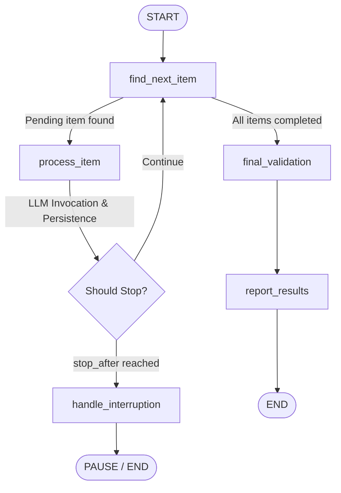

# Assignment 2: Persistent Sequential Agent with LangGraph Checkpointing & Resumption

A production-quality Python agent that processes 5 technical concepts sequentially, persists state after every completed item, supports deterministic interruption and resumption without reprocessing completed items, and performs LLM-driven post-completion validation.

---

## 1. Overview

Long-running agentic workflows in real-world systems are vulnerable to network dropouts, rate limits, infrastructure restarts, or intentional pause points. If a workflow fails or is interrupted after processing several expensive operations, restarting from the beginning wastes time, resources, and API tokens.

This project implements a durable, fault-tolerant agent architecture using **LangGraph**. It demonstrates:
- **Durable Checkpointing**: State is committed to an SQLite database after every individual item is processed.
- **Deterministic Interruption**: Execution can be paused safely (e.g. `--stop-after 3`) with state intact.
- **Intelligent Resumption**: Upon restart, existing checkpoints are detected, completed items are skipped without redundant LLM calls, and execution resumes seamlessly from the first pending item.
- **Content-Aware Validation**: A final validation stage inspects all persisted outputs and catches malformed or corrupted summaries (such as an injected off-topic recipe result).
- **Precise LLM Accounting**: Model invocations are tracked via a central invocation wrapper.

---

## 2. Technical Concepts Task

The agent processes the following **5 technical concepts in strict sequential order**:

1. **`item1`**: **Redis Caching**
2. **`item2`**: **Database Indexing**
3. **`item3`**: **Message Queues**
4. **`item4`**: **Horizontal Scaling**
5. **`item5`**: **Load Balancing**

For each item, the LLM generates a structured technical summary (~80–150 words) answering:
- **What it is**: Core architectural definition
- **Why it is used**: Primary engineering benefits
- **Practical example**: Concrete production use case
- **Important tradeoff**: Operational cost, storage, or consistency consideration

---

## 3. Architecture & LangGraph Workflow

The workflow is built as a stateful graph in LangGraph with conditional routing and durable persistence.



### LangGraph State Schema

The graph maintains an explicit `AgentState` TypedDict:

```python
class ItemProgress(TypedDict):
    topic: str
    status: Literal["pending", "completed", "failed"]
    result: Optional[str]
    llm_calls: int
    completed_at: Optional[str]

class AgentState(TypedDict):
    run_id: str
    items: Dict[str, ItemProgress]
    current_item_id: Optional[str]
    total_llm_calls: int
    stop_after: Optional[int]
    should_stop: bool
    validation_complete: bool
    validation_results: Optional[Dict[str, Any]]
    last_completed_item: Optional[str]
    error: Optional[str]
```

---

## 4. Persistence Architecture

The agent maintains two synchronized persistence layers:

1. **LangGraph SQLite Checkpointer (`state/checkpoints.db`)**:
   - Backed by `langgraph.checkpoint.sqlite.SqliteSaver`.
   - Records full snapshot state transitions under a stable `thread_id` (e.g. `assignment2-demo`).
   - Enables graph restoration at any step.

2. **Human-Readable Audit Artifact (`state/progress.json`)**:
   - Human-readable JSON snapshot updated atomically using a temp file (`progress.tmp` $\to$ `progress.json`) to prevent corruption during sudden terminations.
   - Example schema:
     ```json
     {
       "run_id": "assignment2-demo",
       "updated_at": "2026-09-19T13:33:24Z",
       "total_llm_calls": 3,
       "last_completed_item": "item3",
       "validation_complete": false,
       "items": {
         "item1": { "topic": "Redis Caching", "status": "completed", "result": "...", "llm_calls": 1 },
         "item2": { "topic": "Database Indexing", "status": "completed", "result": "...", "llm_calls": 1 },
         "item3": { "topic": "Message Queues", "status": "completed", "result": "...", "llm_calls": 1 },
         "item4": { "topic": "Horizontal Scaling", "status": "pending", "result": null, "llm_calls": 0 },
         "item5": { "topic": "Load Balancing", "status": "pending", "result": null, "llm_calls": 0 }
       }
     }
     ```

---

## 5. Stop and Resume Workflow

### Step 1: Fresh Run with Interruption
```bash
# Reset state and process items 1 to 3, then intentionally stop
python main.py --reset
python main.py --stop-after 3
```
**Output:**
```text
============================================================
STARTING FRESH RUN (No prior checkpoint found)
Thread ID: assignment2-demo
Deterministic Stop Configured: Stop after item 3
============================================================

[Process] Processing item1: 'Redis Caching'...
[Persist] Successfully persisted progress for item1 -> status/progress.json & checkpoint.

[Process] Processing item2: 'Database Indexing'...
[Persist] Successfully persisted progress for item2 -> status/progress.json & checkpoint.

[Process] Processing item3: 'Message Queues'...
[Persist] Successfully persisted progress for item3 -> status/progress.json & checkpoint.

============================================================
INTENTIONAL INTERRUPTION
Progress safely persisted after item3.
Run the same command without --stop-after to resume.
============================================================
```

### Step 2: Automatic Resumption
```bash
# Resume workflow without re-processing items 1-3
python main.py
```
**Output:**
```text
============================================================
EXISTING CHECKPOINT DETECTED (Resuming workflow)
Thread ID: assignment2-demo
============================================================
item1 -> SKIP (already completed)
item2 -> SKIP (already completed)
item3 -> SKIP (already completed)
item4 -> PENDING (will be processed)
item5 -> PENDING (will be processed)
============================================================

[Process] Processing item4: 'Horizontal Scaling'...
[Persist] Successfully persisted progress for item4 -> status/progress.json & checkpoint.

[Process] Processing item5: 'Load Balancing'...
[Persist] Successfully persisted progress for item5 -> status/progress.json & checkpoint.

============================================================
FINAL VALIDATION PHASE
Re-reading persisted results and validating against expected concepts...
============================================================

FINAL VALIDATION

item1 — Redis Caching
PASS

item2 — Database Indexing
PASS

item3 — Message Queues
PASS

item4 — Horizontal Scaling
PASS

item5 — Load Balancing
PASS

Overall validation: PASSED

============================================================
Total LLM calls: 6
============================================================
```

---

## 6. Deliberate Bad Result & Validation Catch

To demonstrate that validation inspects content rather than blindly trusting status, the project includes an intentional corruption CLI option:

```bash
# Corrupt item3's stored summary with an off-topic cooking recipe
python main.py --corrupt item3

# Run validation against the persisted state
python main.py --validate
```

**Output:**
```text
FINAL VALIDATION

item1 — Redis Caching
PASS

item2 — Database Indexing
PASS

item3 — Message Queues
FAIL
Reason: The stored result discusses unrelated topics (cooking/recipes) instead of Message Queues.

item4 — Horizontal Scaling
PASS

item5 — Load Balancing
PASS

Overall validation: FAILED
```

---

## 7. LLM Call Accounting

Calls are tracked via `TrackedLLM` in [src/llm/client.py](file:///c:/Users/pooja/Desktop/Drift%20Ai%20assignment%202/src/llm/client.py).

- **Concept Summaries**: Exactly 1 call per item $\times$ 5 items = 5 calls.
- **Final Validation**: Exactly 1 call inspecting all 5 concepts = 1 call.
- **Total Expected Calls**: **6 LLM calls**.
- Non-LLM operations (routing, atomic JSON saves, SQLite commits, prompt formatting) **do not** increment the counter.

---

## 8. CLI Commands Reference

| Command | Description |
| :--- | :--- |
| `python main.py --reset` | Clears all checkpoints and resets `state/progress.json`. |
| `python main.py --stop-after 3` | Runs items 1–3, commits checkpoints, and pauses. |
| `python main.py` | Automatically detects checkpoint and resumes pending items. |
| `python main.py --corrupt item3` | Injects an intentionally wrong result into `item3`. |
| `python main.py --validate` | Runs validation on the current persisted summaries. |
| `python main.py --show-state` | Displays the human-readable JSON state. |
| `python main.py --mock` | Executes with the built-in deterministic Mock LLM. |

---

## 9. Testing

Run the full pytest suite:

```bash
python -m pytest -v
```

### Test Matrix

- `tests/test_persistence.py`: Validates atomic file writes and state integrity following an interruption.
- `tests/test_resume.py`: Verifies strict sequential ordering and guarantees zero duplicate LLM calls on resume.
- `tests/test_validation.py`: Tests that the validator passes valid summaries and catches blank or off-topic results.
- `tests/test_llm_counter.py`: Confirms exact invocation count matching real model executions.

---

## 10. Environment Configuration

Copy `.env.example` to `.env`:

```bash
cp .env.example .env
```

Set your configuration:
```env
OPENAI_API_KEY=your_openai_api_key_here
MODEL_NAME=gpt-4o-mini
LANGGRAPH_THREAD_ID=assignment2-demo
```
